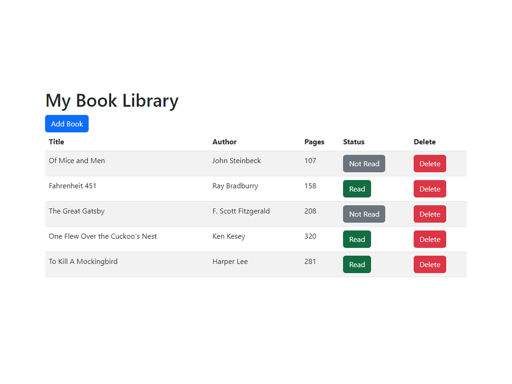

# library

[Live Demo](https://mrespicio.github.io/library/)

## Preview

## Project Goals
Create a library web app where user can track books they've read or plan to read using Javascript OOP and style with CSS Bootstrap. 

## Built With
### Technologies
* HTML
* CSS
* JavaScript
* CSS Bootstrap
### Tools
* Git and GitHub
* Visual Studio Code

## New Skills 
* Used Bootstrap to implment responsiveness
* Used Bootstrap to implement a modal

## Reflection
Although this initially was a simple project, I decided to add the challenge of using CSS Bootstrap for styling and for modal functionality. The styling portion wasn't too difficult to learn, but some other functions were a bit tricky like toggling the Status column as well as getting the DOM to present as intended.

## Misc
This project was created as an assignment for [The Odin Project](https://www.theodinproject.com/lessons/node-path-javascript-library)
Completed: Sep 2023